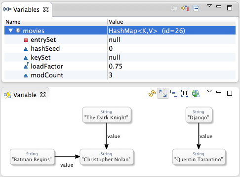

# DebuKViz - KIELER Debug Visualization

Dynamically generates a graphical view of variables selected in the Eclipse Variables view while debugging. Ships with a number of specialized transformations that define how certain classes should be visualized. Can be easily extended with custom transformations for your own data structures.

## Installing DebuKViz

Automatic builds are done every night by the [KIELER Bamboo build system](http://rtsys.informatik.uni-kiel.de/bamboo). To install DebuKViz, open your Eclipse installation and select _Install New Software..._ from the _Help_ menu. Use the following update site:

> http://rtsys.informatik.uni-kiel.de/~kieler/updatesite/nightly-openkieler/

From the _Debugging Visualization_ category, select _DebuKViz_ and install it.

## Using DebuKViz

To use DebuKViz, install it into your existing Eclipse installation from our Nightly Builds update site as explained below. Once that is done, simply click an item in the Variables view while your program is suspended and a graphical representation of it will magically present itself.

## Development

### Building DebuKViz

To build DebuKViz manually from the sources, make sure you have Maven installed. Change into the build directory and execute this command:

    mvn clean package

### Contribute Your Own Code

Our development process is quite easy: the master branch is supposed to always be stable. All development takes place in feature branches. Once a feature is deemed stable enough, the code is merged into the master branch and thus gets shipped through the nightly builds.

#### Setting Up Your Development Environment

You will first need an Eclipse installation to hack away on OpenKieler with. Since we have a shiny Oomph setup available, this turns out to be comparatively painless (note that our setup assumes that you have a GitHub account):

1. Go to [this site](https://www.eclipse.org/downloads/index.php) and download the Eclipse Installer for your platform. You will find the links at the bottom of the "Try the Eclipse Installer" box.

2. Start the installer. Click the Hamburger button at the top right corner and select Advanced Mode. Why? Because we're computer scientists, that's why!

3. Next, we need to tell Oomph to get everything ready for OpenKieler development. Download our [Oomph setup file](https://raw.githubusercontent.com/OpenKieler/config/master/OpenKieler.setup), click the Plus button at the top right corner and add the setup file to the Github Projects catalog. Double-click the new OpenKieler entry. This will cause an item to appear in the table at the bottom of the window. Once you're done, click Next.

3. Oomph now asks you to enter some more information. You can usually leave the settings as is, except for the Installation folder name. This will be the directory under which all your Eclipse installations installed with Oomph will appear, each in a separate sub-directory. Select a proper directory and click Next.

5. If Oomph fails to clone our GitHub repository, this is probably due to Eclipse not finding your SSH key for GitHub. Fix it by going to the Eclipse preferences. You can manage your keys under General > Network Connections > SSH2. Once you have setup your SSH keys, let Oomph try again by selecting Perform Setup Tasks from the Help menu.
